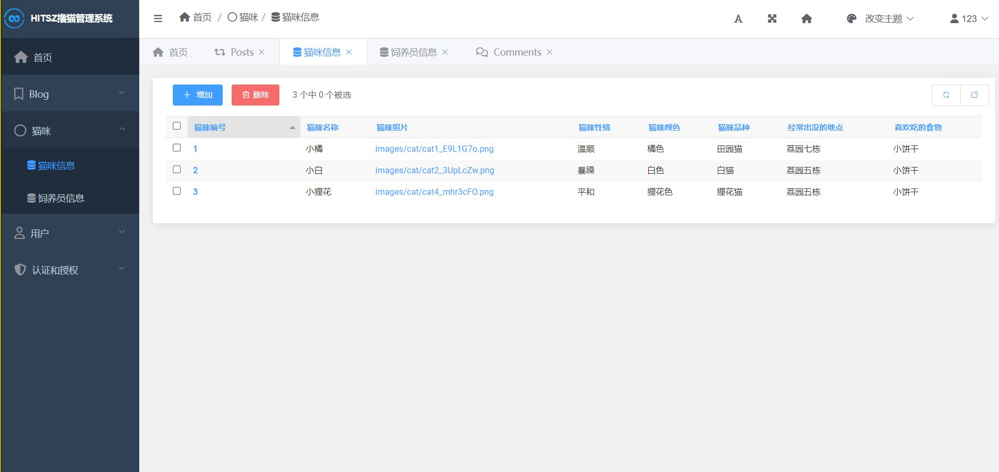
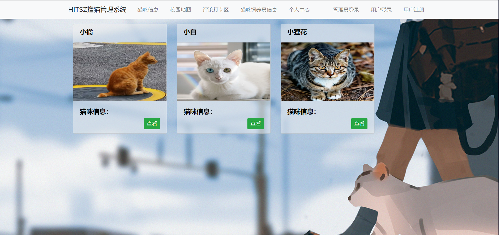

# HITSZ-lumao


---

<p align="center">
    <a href="https://github.com/XuRui314/HITSZ-lumao"></a>
    <a href="https://github.com/python/cpython"></a>
    <a href="https://github.com/XuRui314/HITSZ-lumao"></a>
    <a href="https://github.com/XuRui314/HITSZ-lumao/blob/main/LICENSE"></a> 
</p>


# <p align="center">Campus Canteen Ordering System</p>

HITSZ 2022年秋季学期「数据库设计」课程实验项目，基于 MySQL+Django 实现**撸猫管理系统**。

访问我的博客查看**完整开发文档**

主要环境：

- PowerDesigner
- MySQL Workbench 8.0 CE
- Python 3.8
- Django 3.2.8
- BootStrap 3.3.7
- Django-simpleui

## 系统功能 :snake:

<div align="center">
	
	
</div>


## 项目结构 :pencil:

```
django_lumao
├── blog
│   ├── __init__.py
│   ├── __pycache__
│   │   ├── __init__.cpython-39.pyc
│   │   ├── admin.cpython-39.pyc
│   │   ├── apps.cpython-39.pyc
│   │   ├── forms.cpython-39.pyc
│   │   ├── models.cpython-39.pyc
│   │   ├── urls.cpython-39.pyc
│   │   └── views.cpython-39.pyc
│   ├── admin.py
│   ├── apps.py
│   ├── forms.py
│   ├── migrations
│   │   ├── 0001_initial.py
│   │   ├── __init__.py
│   │   └── __pycache__
│   │       ├── 0001_initial.cpython-39.pyc
│   │       └── __init__.cpython-39.pyc
│   ├── models.py
│   ├── tests.py
│   ├── urls.py
│   └── views.py
├── cat
│   ├── __init__.py
│   ├── __pycache__
│   │   ├── __init__.cpython-39.pyc
│   │   ├── admin.cpython-39.pyc
│   │   ├── apps.cpython-39.pyc
│   │   ├── models.cpython-39.pyc
│   │   ├── urls.cpython-39.pyc
│   │   └── views.cpython-39.pyc
│   ├── admin.py
│   ├── apps.py
│   ├── migrations
│   │   ├── 0001_initial.py
│   │   ├── __init__.py
│   │   └── __pycache__
│   │       ├── 0001_initial.cpython-39.pyc
│   │       └── __init__.cpython-39.pyc
│   ├── models.py
│   ├── tests.py
│   ├── urls.py
│   └── views.py
├── db.sqlite3
├── django_lumao
│   ├── __init__.py
│   ├── __pycache__
│   │   ├── __init__.cpython-39.pyc
│   │   ├── settings.cpython-39.pyc
│   │   ├── urls.cpython-39.pyc
│   │   └── wsgi.cpython-39.pyc
│   ├── asgi.py
│   ├── settings.py
│   ├── urls.py
│   └── wsgi.py
├── manage.py
├── media
│   └── images
│       ├── backimage.jpg
│       ├── cat
│       └── map.png
├── static
│   ├── bootstrap-3.3.7-dist
│   │   ├── css
│   │   ├── fonts
│   │   └── js
│   ├── css
│   └── js
├── templates
│   ├── base.html
│   ├── blog
│   │   ├── base_post.html
│   │   ├── index.html
│   │   ├── post_detail.html
│   │   └── sidebar.html
│   ├── cat
│   │   ├── cat_base.html
│   │   └── cat_list.html
│   ├── show_catandfeeder.html
│   ├── show_onecat.html
│   ├── showmap.html
│   └── user
│       ├── inclusions
│       │   ├── _form.html
│       │   └── _list.html
│       ├── index.html
│       ├── information.html
│       ├── login.html
│       ├── logout.html
│       ├── preview.html
│       ├── register.html
│       └── show_info.html
└── user
    ├── __init__.py
    ├── __pycache__
    │   ├── __init__.cpython-39.pyc
    │   ├── admin.cpython-39.pyc
    │   ├── apps.cpython-39.pyc
    │   ├── forms.cpython-39.pyc
    │   ├── models.cpython-39.pyc
    │   ├── urls.cpython-39.pyc
    │   └── views.cpython-39.pyc
    ├── admin.py
    ├── apps.py
    ├── forms.py
    ├── migrations
    │   ├── 0001_initial.py
    │   ├── __init__.py
    │   └── __pycache__
    │       ├── 0001_initial.cpython-39.pyc
    │       └── __init__.cpython-39.pyc
    ├── models.py
    ├── tests.py
    ├── urls.py
    └── views.py

```

## 快速开始 

1. 初始化：

   - 克隆本项目 ` git clone https://github.com/XuRui314/HITSZ-lumao`

   - 卸载原依赖 `pip uninstall -y -r requirement.txt`

   - 配置新依赖 `pip install -r requirements.txt`

2. 数据库准备：

   - 打开 MySQL Workbench 服务器，创建本地数据库 `create database django_CCOS`

   - 项目参数修改：打开 settings.py 配置文件，找到 MySQL 自定义参数，修改为你自己的配置

4. 项目启动，进入项目 `django_CCOS` 目录，执行：
   - `python manage.py makemigrations`
   - `python manage.py migrate`
   - `python manage.py runserver`
   
5. 前端访问：http://127.0.0.1:8000

5. 后台访问：http://127.0.0.1:8000/admin
   - 创建管理员：`python manage.py createsuperuser`
   - 自行添加食堂、窗口、菜品，否则初始不显示

## 效果图 :yum:


## 鸣谢 :love_letter:

 参考何为大佬的实现
